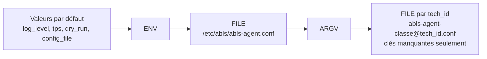

# Configuration d'un agent et précédence

Tous les agents Abls-Habitat partagent le **même mécanisme de configuration**, fourni par la
bibliothèque `abls-libs`. Comprendre ce mécanisme, c'est pouvoir diagnostiquer en quelques secondes
un agent qui ne prend pas en compte le paramètre que vous venez de changer.

---

## Les trois sources de configuration

Un agent lit sa configuration depuis trois sources :

| Source | Forme | Usage typique |
|---|---|---|
| **ENV** — variables d'environnement | `ABLS_API_URL=...` | Conteneurs, unités systemd, tests |
| **FILE** — fichier JSON | `/etc/abls/abls-agent.conf` | Configuration permanente de la machine |
| **ARGV** — ligne de commande | `--api-url ...` | Dépannage, enrôlement initial, `ExecStart` |

---

## L'ordre d'application

Au démarrage, l'agent applique ces sources **dans cet ordre**, chacune écrasant la précédente :



!!! danger "La précédence effective est l'inverse de l'ordre d'application"
    L'ordre d'**application** est **ENV → FILE → ARGV**.
    Puisque chaque étape écrase la précédente, la précédence **effective** est donc :

    **ARGV > FILE > ENV > valeurs par défaut**

    Autrement dit : une variable d'environnement est **écrasée** par le fichier de configuration.
    C'est le piège le plus fréquent. Si vous posez `ABLS_API_URL` dans l'environnement alors que
    `api_url` figure déjà dans `/etc/abls/abls-agent.conf`, **c'est le fichier qui gagne**.

### Le cas particulier du fichier par `tech_id`

Après ces trois sources, l'agent charge un second fichier,
`/etc/abls/abls-agent-<classe>@<tech_id>.conf`, en mode **« seulement si la clé est absente »**.
Ce fichier ne peut donc **jamais** écraser une valeur déjà définie : il sert uniquement à compléter.

C'est pourtant ce fichier qu'écrit l'option `--save`. Conséquence pratique : une clé présente
à la fois dans `abls-agent.conf` et dans `abls-agent-<classe>@<tech_id>.conf` sera toujours
résolue par la première.

!!! tip "Règle de rangement"
    - `/etc/abls/abls-agent.conf` : ce qui est **commun à la machine** (URL de l'API, CA MQTT).
    - `/etc/abls/abls-agent-<classe>@<tech_id>.conf` : ce qui est **propre à une instance**
      (identifiants du domaine, paramètres du matériel).

    Ne dupliquez pas une clé entre les deux fichiers.

---

## Changer le fichier de configuration : `ABLS_CONFIG_FILE`

Le chemin du fichier principal est lui-même un paramètre, `config_file`, dont la valeur par défaut
est `/etc/abls/abls-agent.conf`.

Comme les variables d'environnement sont appliquées **avant** la lecture du fichier, définir
`ABLS_CONFIG_FILE` permet de rediriger l'agent vers un autre fichier :

```bash
ABLS_CONFIG_FILE=/opt/recette/abls-agent.conf abls-agent-modbus --agent-tech-id MODBUS_TEST
```

C'est le seul paramètre pour lequel la variable d'environnement a un effet garanti, puisqu'elle
est consommée avant que le fichier n'ait la possibilité de l'écraser.

!!! warning
    `--config-file` **n'existe pas** en ligne de commande. Seule la variable d'environnement
    `ABLS_CONFIG_FILE` permet de changer ce chemin.

Cas d'usage :

- faire tourner un agent de recette à côté de l'agent de production sur la même machine ;
- tester une configuration sans toucher à `/etc/abls/` ;
- injecter la configuration dans un conteneur via un volume monté ailleurs.

Dans une unité systemd :

```ini
[Service]
Environment=ABLS_CONFIG_FILE=/opt/recette/abls-agent.conf
ExecStart=/usr/bin/abls-agent-modbus --agent-tech-id MODBUS_TEST
```

---

## Format du fichier de configuration

Un fichier **JSON** plat, en UTF-8, dont les clés sont les noms de paramètres.

```json
{
  "domain_uuid":   "xxxxxxxx-xxxx-xxxx-xxxx-xxxxxxxxxxxx",
  "domain_secret": "votre-secret-ici",
  "agent_tech_id": "MODBUS_CHAUFFERIE",
  "api_url":       "api.abls-habitat.fr",
  "tps":           50,
  "log_level":     6,
  "mqtt_over_ssl": true,
  "mqtt_ca_file":  ""
}
```

!!! warning "Permissions"
    Ce fichier contient le `domain_secret`. `--save` le crée en `root:abls` avec le mode `0640`.
    Si vous l'écrivez à la main, reproduisez ces permissions :

    ```bash
    sudo chown root:abls /etc/abls/abls-agent-modbus@MODBUS_CHAUFFERIE.conf
    sudo chmod 0640      /etc/abls/abls-agent-modbus@MODBUS_CHAUFFERIE.conf
    ```

Un fichier illisible ou invalide n'est pas bloquant : l'agent journalise un avertissement
`Unable to read file config '...'` et poursuit avec les autres sources.

---

## Nommage des variables d'environnement

Toute variable préfixée par `ABLS_` est convertie en clé de configuration : le préfixe est retiré
et le reste est passé en minuscules.

| Variable d'environnement | Clé de configuration |
|---|---|
| `ABLS_DOMAIN_UUID` | `domain_uuid` |
| `ABLS_DOMAIN_SECRET` | `domain_secret` |
| `ABLS_AGENT_TECH_ID` | `agent_tech_id` |
| `ABLS_API_URL` | `api_url` |
| `ABLS_CONFIG_FILE` | `config_file` |
| `ABLS_TPS` | `tps` |

Le **type** de la valeur est déduit de son contenu :

| Contenu de la variable | Type obtenu |
|---|---|
| `TRUE` / `FALSE` (insensible à la casse) | booléen |
| Entier strict (`50`, `-3`) | entier |
| Tout le reste (`127.0.0.1`, `api.abls-habitat.fr`) | chaîne |

!!! note
    `127.0.0.1` reste bien une chaîne : la conversion en entier n'a lieu que si la valeur est
    **intégralement** numérique.

---

## Options de ligne de commande

Les options sont converties en clés de configuration en remplaçant les tirets par des
soulignés : `--agent-tech-id` alimente `agent_tech_id`.

| Option | Type | Clé |
|---|---|---|
| `--domain-uuid UUID` | chaîne | `domain_uuid` |
| `--domain-secret SECRET` | chaîne | `domain_secret` |
| `--server-uuid UUID` | chaîne | `server_uuid` |
| `--agent-tech-id TECH_ID` | chaîne | `agent_tech_id` |
| `--api-url URL` | chaîne | `api_url` |
| `--tps TPS` | entier | `tps` |
| `--dry-run` | drapeau | `dry_run` |
| `--standalone` | drapeau | `standalone` |
| `--master-hostname HOSTNAME` | chaîne | `master_hostname` |
| `--save` | drapeau | — (voir ci-dessous) |
| `--help` | drapeau | affiche l'aide et quitte |

Chaque classe d'agent ajoute ses propres options ; consultez le
[catalogue](catalogue/index.md) ou lancez `abls-agent-<classe> --help`.

!!! warning "Deux limites des options en ligne de commande"
    - **Un drapeau ne sait que passer à `true`.** Il n'existe pas de `--no-dry-run` :
      pour désactiver une option activée dans le fichier, retirez-la du fichier.
    - **Une option entière valant `0` est ignorée.** `--tps 0` n'a aucun effet ; la valeur
      héritée de la source précédente est conservée.

---

## Enregistrer la configuration : `--save`

```bash
sudo abls-agent-modbus --agent-tech-id MODBUS_CHAUFFERIE \
                       --domain-uuid xxxxxxxx-xxxx-xxxx-xxxx-xxxxxxxxxxxx \
                       --domain-secret 'votre-secret-ici' \
                       --save
```

Comportement :

1. la configuration résolue (ENV + FILE + ARGV) est écrite dans
   `/etc/abls/abls-agent-<classe>@<tech_id>.conf` ;
2. la clé `save` elle-même n'est pas enregistrée ;
3. le fichier reçoit `root:abls` et le mode `0640` ;
4. **l'agent s'arrête immédiatement.** `--save` ne démarre pas le service.

!!! danger "`--save` exige les droits root"
    Sans `root`, l'agent affiche `Must be root to save config to ...` et quitte sans rien écrire.

!!! warning "`--save` écrit tout ce qu'il a résolu"
    Si des variables `ABLS_*` traînent dans votre shell, elles seront figées dans le fichier.
    Vérifiez avec `env | grep ^ABLS_` avant de lancer la commande.

---

## Paramètres obligatoires

L'agent refuse de démarrer si l'un de ces contrôles échoue :

| Condition | Paramètre requis | Message de journal |
|---|---|---|
| Toujours | `agent_tech_id` | `There is no 'agent_tech_id', in config, exiting.` |
| Mode normal | `api_url` | `There is no 'api_url', in config, exiting.` |
| Mode normal | `domain_uuid` | `There is no 'domain_uuid', in config, exiting.` |
| Mode normal | `domain_secret` | `There is no 'domain_secret', in config, exiting.` |
| [Mode standalone](standalone.md) | `master_hostname` | `There is no 'master_hostname', in config, exiting.` |

`server_uuid` fait exception : s'il est absent, l'agent en génère un et journalise
`There is no 'server_uuid', creating one.` Pensez à le figer avec `--save` si vous voulez
qu'il survive à une réinstallation.

---

## Diagnostiquer : quelle valeur a réellement été retenue ?

À chaque démarrage, l'agent journalise la configuration résolue sous l'étiquette `local_config`,
ainsi qu'une ligne par variable d'environnement appliquée :

```bash
sudo journalctl -u abls-agent-modbus@MODBUS_CHAUFFERIE.service | grep -E "Apply ENV|local_config|config file"
```

Vous y lirez, dans l'ordre :

```text
Apply ENVironment Variables
Apply ENV 'ABLS_API_URL' -> 'api_url' = 'api.abls-habitat.fr'
Trying to read config file '/etc/abls/abls-agent.conf'
Apply Command-Line Arguments
Trying to read config file '/etc/abls/abls-agent-modbus@MODBUS_CHAUFFERIE.conf'
local_config : { ... }
```

C'est la ligne `local_config` qui fait foi.

---

## Trois cas concrets

???+ example "Cas 1 — « Ma variable d'environnement est ignorée »"
    `ABLS_API_URL=https://api.interne.lan` est définie, mais l'agent contacte toujours
    `api.abls-habitat.fr`.

    **Cause :** `api_url` est présent dans `/etc/abls/abls-agent.conf`, qui est appliqué *après*
    l'environnement.

    **Remède :** retirer la clé du fichier, ou passer `--api-url` en ligne de commande.

???+ example "Cas 2 — « Mon `--save` n'a pas pris le bon `tech_id` »"
    Le fichier créé s'appelle `abls-agent-modbus@ANCIEN_ID.conf`.

    **Cause :** `agent_tech_id` était déjà résolu depuis une autre source et l'option
    `--agent-tech-id` n'a pas été passée lors du `--save`.

    **Remède :** toujours passer `--agent-tech-id` explicitement lors d'un `--save`.

???+ example "Cas 3 — « Deux agents de la même classe se marchent dessus »"
    Deux instances Modbus partagent le même `agent_tech_id`.

    **Cause :** `agent_tech_id` est posé dans le fichier commun `/etc/abls/abls-agent.conf`,
    hérité par les deux instances.

    **Remède :** ne jamais mettre `agent_tech_id` dans le fichier commun. L'unité systemd
    templatée le fournit déjà via `--agent-tech-id %i`.

---

## Pour aller plus loin

- [Référence exhaustive des paramètres communs](parametres-communs.md)
- [Paramètres propres à chaque classe d'agent](catalogue/index.md)
- [Enrôlement sur le domaine](enrolement.md)
- [Mode standalone](standalone.md)
