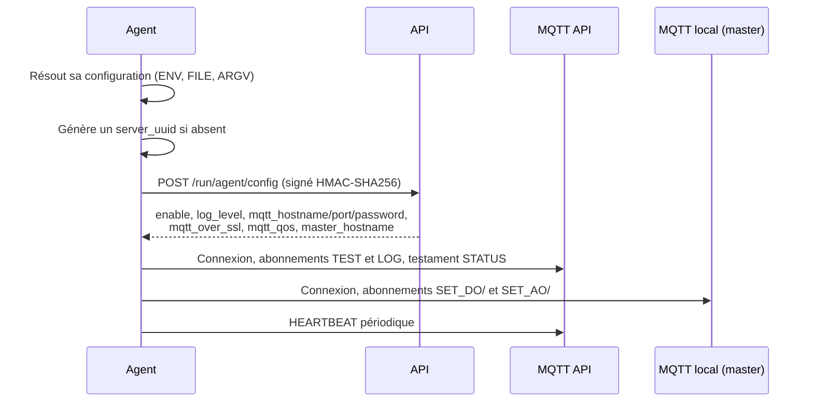

# Enrôler un agent sur le domaine

Enrôler, c'est donner à l'agent les trois informations qui lui permettent de trouver le domaine et
de prouver son identité, puis vérifier que l'API l'accepte.

---

## Ce qu'il faut récupérer avant de commencer

Depuis la [Console](https://console.abls-habitat.fr), page **Domaine** :

| Donnée | Rôle |
|---|---|
| `domain_uuid` | Identifie le domaine |
| `domain_secret` | Authentifie l'agent auprès de l'API |
| `api_url` | Point d'entrée de l'API — `api.abls-habitat.fr` par défaut |

!!! danger "Le `domain_secret` est confidentiel"
    Il ouvre l'accès complet au domaine. Ne le partagez pas, ne le versionnez pas, ne le
    collez pas dans un ticket. Sa consultation dans la Console requiert le niveau 6 minimum.

Vous devez également choisir un **`agent_tech_id`** : un identifiant stable et unique dans le
domaine, sans espace. Par exemple `MODBUS_CHAUFFERIE`.

---

## La méthode la plus simple : par la Console

La Console propose un assistant : menu **[Ajouter un agent](https://console.abls-habitat.fr/agent/add)**.
Elle génère la ligne de commande à copier-coller sur la machine cible, avec les bons identifiants
déjà remplis.

---

## La méthode manuelle

```bash
sudo abls-agent-modbus --agent-tech-id MODBUS_CHAUFFERIE \
                       --domain-uuid   xxxxxxxx-xxxx-xxxx-xxxx-xxxxxxxxxxxx \
                       --domain-secret 'votre-secret-ici' \
                       --api-url       api.abls-habitat.fr \
                       --save
```

`--save` écrit `/etc/abls/abls-agent-modbus@MODBUS_CHAUFFERIE.conf` en `root:abls` / `0640`,
puis **quitte**. Il ne démarre pas le service.

Démarrez ensuite :

```bash
sudo systemctl enable --now abls-agent-modbus@MODBUS_CHAUFFERIE.service
```

!!! tip "Éviter que le secret apparaisse dans `ps` et dans l'historique du shell"
    Sur une machine partagée, préférez écrire directement le fichier :

    ```bash
    sudo install -d -m 0750 -o root -g abls /etc/abls
    sudo tee /etc/abls/abls-agent-modbus@MODBUS_CHAUFFERIE.conf >/dev/null <<'EOF'
    {
      "agent_tech_id": "MODBUS_CHAUFFERIE",
      "domain_uuid":   "xxxxxxxx-xxxx-xxxx-xxxx-xxxxxxxxxxxx",
      "domain_secret": "votre-secret-ici",
      "api_url":       "api.abls-habitat.fr"
    }
    EOF
    sudo chown root:abls /etc/abls/abls-agent-modbus@MODBUS_CHAUFFERIE.conf
    sudo chmod 0640      /etc/abls/abls-agent-modbus@MODBUS_CHAUFFERIE.conf
    ```

    Attention : ce fichier n'est lu qu'**après** résolution du `tech_id`. L'unité templatée
    fournissant `--agent-tech-id %i`, la séquence fonctionne. Pour un agent à unité simple
    (`server`, `dls`), placez `agent_tech_id` dans `/etc/abls/abls-agent.conf`.

---

## Ce qui se passe au démarrage



### 1. Appel d'enrôlement

L'agent poste sur `https://<api_url>/run/agent/config` un corps JSON :

```json
{
  "agent_classe":  "modbus",
  "agent_tech_id": "MODBUS_CHAUFFERIE",
  "version":       "…",
  "start_time":    1759190400
}
```

La requête est signée. Les en-têtes portent l'identité et la preuve :

| En-tête | Contenu |
|---|---|
| `X-ABLS-DOMAIN` | `domain_uuid` |
| `X-ABLS-SERVER` | `server_uuid` |
| `X-ABLS-AGENT` | `agent_tech_id` |
| `X-ABLS-TIMESTAMP` | Horodatage de la requête |
| `X-ABLS-SIGNATURE` | HMAC-SHA256 sur l'ensemble, salé par le `domain_secret` |

!!! warning "L'heure système doit être juste"
    L'horodatage entre dans le calcul de la signature. Une machine dont l'horloge dérive de
    plusieurs minutes verra ses requêtes rejetées. Vérifiez que NTP est actif :

    ```bash
    timedatectl status
    ```

### 2. Réponse de l'API

L'API répond `200` avec la configuration à distance :

| Clé | Effet |
|---|---|
| `enable` | Si `false`, **l'agent s'arrête immédiatement** |
| `log_level` | Écrase la verbosité locale |
| `mqtt_hostname`, `mqtt_port` | Broker MQTT de l'API |
| `mqtt_password` | Mot de passe du compte `<domain_uuid>-agent` |
| `mqtt_over_ssl`, `mqtt_qos` | Options de transport |
| `master_hostname` | Broker MQTT local du site |

!!! note "Rien de tout cela n'est à configurer localement"
    N'écrivez jamais `mqtt_hostname` ou `mqtt_password` dans le fichier local : ces valeurs sont
    gérées par l'API et peuvent changer.

### 3. Connexion aux deux bus MQTT

| Bus | Adresse | Abonnements | Rôle |
|---|---|---|---|
| **MQTT API** | `mqtt_hostname:mqtt_port` | `<domain>/AGENT/<tech_id>/TEST`, `.../LOG` | Pilotage à distance, remontée d'état |
| **MQTT local** | `master_hostname:1883` | `SET_DO/<tech_id>/#`, `SET_AO/<tech_id>/#` | Commandes du moteur D.L.S vers les sorties |

L'agent publie un **testament** (*last will*) sur `<domain>/AGENT/<tech_id>/STATUS` :
si la liaison tombe, le broker publie `{"status": "dead"}` et la Console affiche l'agent hors
service. Un `HEARTBEAT` périodique entretient l'indicateur de vie.

---

## Vérifier que l'enrôlement a réussi

**Sur la machine :**

```bash
sudo journalctl -u abls-agent-modbus@MODBUS_CHAUFFERIE.service -f
```

Vous devez voir, dans l'ordre : la configuration résolue (`local_config`), la configuration
distante (`api_config`), puis les connexions MQTT.

**Dans la Console :** page [Agents](https://console.abls-habitat.fr/agents), l'agent apparaît
avec son heartbeat et sa version.

---

## Dépannage

| Message de journal | Cause | Remède |
|---|---|---|
| `There is no 'agent_tech_id', in config, exiting.` | `tech_id` non résolu | Voir [configuration](configuration.md) ; pour `server`/`dls`, le poser dans `abls-agent.conf` |
| `There is no 'domain_uuid'/'domain_secret'/'api_url'` | Enrôlement incomplet | Refaire le `--save` avec toutes les options |
| `POST_CONFIG from API Failed. Unloading.` | API injoignable, signature invalide, ou horloge décalée | Tester la résolution DNS et la connectivité HTTPS, vérifier `timedatectl` et le `domain_secret` |
| `Agent disabled in API config. Unloading.` | Agent désactivé côté Console | Activer l'agent dans la Console |
| Boucle de redémarrage toutes les 5 s | L'agent quitte au démarrage | Lire la ligne précédant l'arrêt dans `journalctl` |

Test manuel de joignabilité de l'API :

```bash
curl -sS -o /dev/null -w '%{http_code}\n' https://api.abls-habitat.fr/status
```

---

## Changer d'identifiants ou de domaine

1. Arrêter le service ;
2. supprimer `/etc/abls/abls-agent-<classe>@<tech_id>.conf` ;
3. relancer l'enrôlement avec les nouveaux identifiants ;
4. redémarrer le service ;
5. supprimer l'ancien agent dans la Console s'il n'a plus lieu d'être.

!!! danger "Rotation du `domain_secret`"
    Changer le `domain_secret` invalide **tous** les agents du domaine simultanément.
    Prévoyez de rejouer l'enrôlement sur chaque machine dans la foulée.

---

## Étape suivante

- [Configuration et précédence](configuration.md)
- [Paramètres communs](parametres-communs.md)
- [Déclarer l'agent côté technicien](../../technicien/parcours/01-agent.md)
