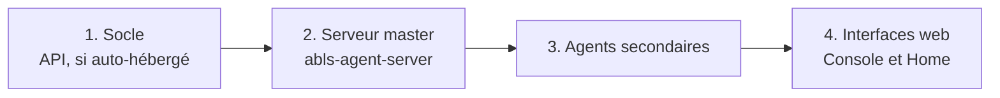

# Mettre à jour

---

## Depuis la Console (recommandé)

La page [Agents](https://console.abls-habitat.fr/agents) permet de déclencher la mise à jour
d'un agent à distance. L'agent télécharge et installe le paquet avec le gestionnaire natif de
sa distribution, puis redémarre.

C'est la méthode la plus sûre : l'API connaît les versions installées et signale les écarts.

---

## Depuis la machine

=== "Debian / Raspberry Pi OS"

    ```bash
    sudo apt update
    sudo apt install --only-upgrade 'abls-*'
    ```

=== "Fedora / RHEL"

    ```bash
    sudo dnf makecache
    sudo dnf upgrade 'abls-*'
    ```

!!! note "Les paquets ne redémarrent pas les services"
    C'est volontaire : un redémarrage intempestif d'un agent pilotant un automate peut avoir des
    conséquences physiques. Le redémarrage est toujours une décision explicite :

    ```bash
    sudo systemctl restart abls-agent-modbus@MODBUS_CHAUFFERIE.service
    ```

---

## Ordre de mise à jour

Sur un domaine de plusieurs machines, respectez cet ordre :



!!! warning "Ne mettez pas à jour tout le parc d'un coup"
    Procédez machine par machine, en vérifiant le retour en service de chacune avant de passer
    à la suivante. Un agent qui ne redémarre pas est beaucoup plus facile à diagnostiquer seul.

---

## Vérifier après mise à jour

```bash
# Version installée
dpkg -l 'abls-*'        # Debian
rpm -qa 'abls-*'        # Fedora

# Le service est-il bien reparti ?
systemctl is-active abls-agent-modbus@MODBUS_CHAUFFERIE.service

# L'enrôlement s'est-il bien refait ?
sudo journalctl -u abls-agent-modbus@MODBUS_CHAUFFERIE.service -n 40
```

Dans la Console, la version remontée par l'agent doit correspondre à celle installée.

---

## Que devient la configuration ?

Les fichiers `/etc/abls/*.conf` ne sont **pas** écrasés par une mise à jour. Vous n'avez pas à
refaire l'enrôlement.

En cas de conflit sur un fichier de configuration géré par le paquet, APT propose de conserver
la version locale : répondez **N** (garder votre version) sauf indication contraire dans les
notes de version.

---

## Revenir en arrière

=== "Debian / Raspberry Pi OS"

    ```bash
    # Lister les versions disponibles
    apt-cache madison abls-agent-modbus

    # Installer une version précise
    sudo apt install abls-agent-modbus=<version>
    ```

=== "Fedora / RHEL"

    ```bash
    sudo dnf downgrade abls-agent-modbus
    ```

!!! danger "Le retour arrière n'est pas toujours possible"
    Si l'API a été mise à jour et a fait évoluer son schéma de base, les agents d'ancienne
    version peuvent ne plus être acceptés. Vérifiez les notes de version avant de descendre
    un agent isolé.

---

## Mettre à jour le socle auto-hébergé

1. Sauvegarder la base de données ([procédure](sauvegarde.md)).
2. Mettre à jour le paquet `abls-habitat-api` et redémarrer le service.
3. Vérifier `https://votre-api.example.com/status` et les journaux.
4. Mettre à jour les interfaces web ([Console et Home](../socle/console-home.md#mise-a-jour-des-interfaces)).
5. Mettre à jour les agents.

!!! danger "Sauvegardez avant toute montée de version de l'API"
    L'API applique automatiquement les migrations de schéma au démarrage. Ces migrations ne sont
    pas réversibles.

---

## Mises à jour du système d'exploitation

Les agents suivent les bibliothèques système (GLib, libcurl, libmodbus, libgpiod…).
Une montée de version majeure de la distribution (Bookworm vers Trixie, par exemple) impose de
basculer aussi le dépôt Abls :

```bash
source /etc/os-release
sudo rm /etc/apt/sources.list.d/abls-pkgs-*.sources
sudo wget -O /etc/apt/sources.list.d/abls-pkgs-${VERSION_CODENAME}.sources \
     https://pkgs.abls-habitat.fr/abls-pkgs-${VERSION_CODENAME}.sources
sudo apt update && sudo apt install --only-upgrade 'abls-*'
```
