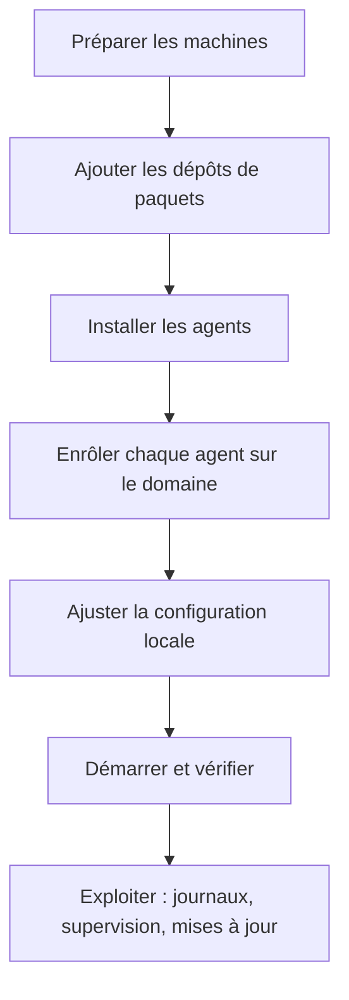

# Volet Administrateur

Ce volet s'adresse à la personne qui **installe et maintient les systèmes** : machines, paquets,
services, réseau. Il suppose une aisance avec Linux, `systemd` et le gestionnaire de paquets de
votre distribution.

!!! note "Ce volet ne traite pas…"
    …de la logique d'automatisation ni des écrans. Écrire du D.L.S, mapper les I/O et dessiner les
    synoptiques relèvent du [volet Technicien](../technicien/index.md). Piloter son habitat au
    quotidien relève du [volet Utilisateur](../utilisateur/index.md).

---

## Ce que vous allez faire

---

## Parcours recommandé

| Étape | Page | Objectif |
|---|---|---|
| 0 | [Pré-requis](prerequis.md) | Vérifier matériel, OS, réseau et droits |
| 1 | [Choisir son hébergement](socle/architecture.md) | Cloud du projet ou socle auto-hébergé |
| 2 | [Dépôts de paquets](agents/depots.md) | Déclarer les dépôts APT ou DNF |
| 3 | [Installation et services](agents/installation.md) | Installer les paquets et activer les unités systemd |
| 4 | [Enrôlement sur le domaine](agents/enrolement.md) | Relier l'agent au domaine et à l'API |
| 5 | [Configuration et précédence](agents/configuration.md) | Savoir où poser un paramètre et qui l'emporte |
| 6 | [Paramètres communs](agents/parametres-communs.md) | Référence exhaustive des clés |
| 7 | [Catalogue des agents](agents/catalogue/index.md) | Spécificités de chaque classe d'agent |
| 8 | [Exploitation](exploitation/journaux.md) | Journaux, supervision, mises à jour, sauvegarde |

!!! tip "Vous utilisez le Cloud du projet ?"
    Si vous ne souhaitez pas héberger l'API vous-même, sautez directement l'étape 1 et le chapitre
    **Le socle** : `api.abls-habitat.fr` est déjà en place et vos agents s'y enrôlent sans
    configuration supplémentaire.

---

## Les objets que vous manipulez

| Objet | Identifiant | Où il est défini |
|---|---|---|
| **Domaine** | `domain_uuid` + `domain_secret` | Créé depuis la [Console](https://console.abls-habitat.fr) |
| **Serveur** | `server_uuid` | Généré automatiquement au premier démarrage d'un agent |
| **Agent** | `agent_classe` + `agent_tech_id` | Choisi par vous, déclaré dans la Console |
| **Service** | `abls-agent-<classe>@<tech_id>.service` | Fourni par le paquet |
| **Configuration** | `/etc/abls/abls-agent*.conf` | Fichiers JSON, voir [configuration](agents/configuration.md) |

---

## Les trois règles à retenir

1. **Le `domain_secret` est une donnée confidentielle.** Il donne un accès complet au domaine.
   Il ne doit jamais apparaître dans un dépôt Git, un ticket ou une capture d'écran.
2. **Un `agent_tech_id` est obligatoire et unique.** Sans lui, l'agent refuse de démarrer.
   Il apparaît dans le nom du service, du fichier de configuration et des topics MQTT.
3. **La ligne de commande l'emporte sur tout le reste.** En cas de comportement inattendu,
   relisez [la page sur la précédence](agents/configuration.md) avant de chercher ailleurs.
