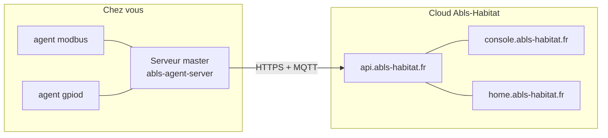
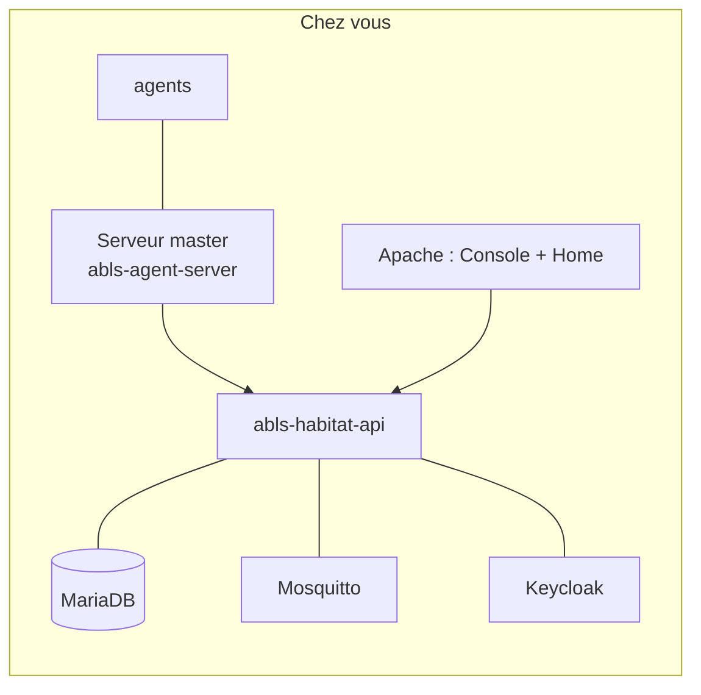

# Choisir son hébergement

Deux modèles de déploiement coexistent. Le choix se fait une fois, au début, et conditionne
la charge d'exploitation que vous acceptez de porter.

---

## Modèle 1 — Cloud du projet (recommandé)

Vous n'installez que les **agents**, chez vous. Le socle est opéré par le projet.

| Ce que vous gérez | Ce que le projet gère |
|---|---|
| Machines et agents | API, base de données, broker MQTT |
| Réseau local et matériel | Console, Home, fournisseur d'identité |
| Sauvegarde de votre configuration locale | Sauvegarde des données du domaine |

**Choisissez ce modèle si** vous voulez une installation domestique qui fonctionne sans
administration de serveur.

---

## Modèle 2 — Socle auto-hébergé (*on premise*)

Vous hébergez également l'API et ses dépendances.

| Ce que vous gérez |
|---|
| Tout du modèle 1, **plus** : API, MariaDB, Mosquitto, Keycloak, Apache, certificats TLS, sauvegardes, mises à jour |

**Choisissez ce modèle si** vous avez une contrainte de souveraineté des données, pas d'accès
Internet permanent, ou un usage professionnel multi-domaines.

!!! warning "Le coût réel de l'auto-hébergement"
    Compter la mise en place n'est pas suffisant : il faut aussi assurer dans la durée la
    rotation des certificats, les sauvegardes testées, les montées de version coordonnées entre
    l'API et les agents. Ne vous engagez dans ce modèle que si vous êtes prêt à exploiter.

---

## Comparatif

| Critère | Cloud du projet | Auto-hébergé |
|---|---|---|
| Effort initial | Faible | Élevé |
| Effort récurrent | Quasi nul | Réel |
| Accès à distance | Immédiat | À construire (DNS, TLS, ouverture) |
| Souveraineté des données | Hébergée par le projet | Totale |
| Fonctionnement sans Internet | Non (hors [standalone](../agents/standalone.md)) | Oui |
| Mises à jour du socle | Automatiques | À votre charge |

---

## Une troisième voie : le mode standalone

Pour un banc de test ou un site totalement isolé, un agent peut fonctionner **sans API du tout**.
Il perd alors la Console, l'historique et les synoptiques.
Voir [Mode standalone](../agents/standalone.md).

---

## Si vous choisissez l'auto-hébergement

Suivez les pages dans cet ordre :

1. [Base de données](base-de-donnees.md)
2. [Broker MQTT](mqtt.md)
3. [Installer l'API](api.md)
4. [Console et Home](console-home.md)

Puis reprenez le parcours commun à partir des [dépôts de paquets](../agents/depots.md).
