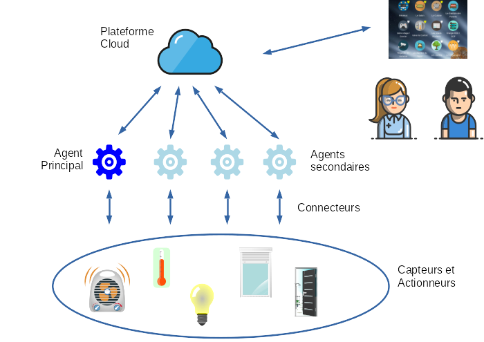

# Architecture du projet

Les éléments constituant le projet sont architecturés au sein d'un domaine.
Un domaine représente un univers dans lequel tous les composants pourront intéragir ensemble.

!!! note

    A contrario, deux éléments de deux domaines différents ***ne pourront pas*** intéragir.

Généralement, vous disposez d'un unique domaine représentant l'ensemble de votre habitat. Vu d'un peu plus près, les composants
d'un domaine sont les suivants:

##Les capteurs et actionneurs

Il s'agit de tous les éléments capturant l'environnement ou pouvant agir dessus. Par exemple, une prise electrique commandable,
un télérupteur ou encore un contacteur.

Tous ces capteurs et actionneurs sont pilotés au travers des différents [connecteurs](connecteurs.md).

##Les Agents

Les agents sont des composants logiciels installés sur une ou plusieurs de vos machines, chez vous. Il ont la mission
d'échanger avec vos capteurs et actionneurs, via leur capacité à se [connecter](connecteurs.md) à ces éléments.

L'ensemble des agents sont inter-connectés au travers d'un bus.
Chacun des agents se synchronise avec [la plateforme cloud](#la-plateforme-cloud) qui sera détaillée ci dessous.
Pour installer un agent sur une de vos machines, suivez la [procédure d'installation](guide_demarrage.md).

##L'agent principal

Dans un domaine, un agent particulier a pour objet de faire tourner [l'intelligence](dls.md) de la plateforme. Cet agent est dit
**principal** ou, en anglais, **master**

!!! note

    Un seul et unique agent est ***principal*** à l'intérieur d'un même domaine. Les autres sont des agents secondaires.

##L'interface de navigation et de contrôle

Elle permet aux [utilisateurs](users.md) de visualiser et d'interagir avec leur habitat connecté via une interface web conviviale.
On y retrouve des tableaux de bord personnalisables pour suivre en temps réel :

* Les températures (intérieures/extérieures)
* La consommation électrique
* L'état des capteurs et actionneurs (ex : volets, éclairage, pompes)
* Les alertes et notifications (ex : fuite d'eau, température anormale)

Cette plateforme est le point d'entrée pour les utilisateurs réguliers.
Elle est disponible à travers [ce lien](https://home.abls-habitat.fr).

##La plateforme des utilisateurs à privilèges

Cette plateforme est reservée aux utilisateurs à privilèges.
Elle permet:
* de centraliser la gestion des agents
* de définir les synoptiques et les tableaux de bord
* de rediger les modules D.L.S
* de configurer les messages et les zones de diffusion audio

Elle est disponible a travers [ce lien](https://console.abls-habitat.fr).
