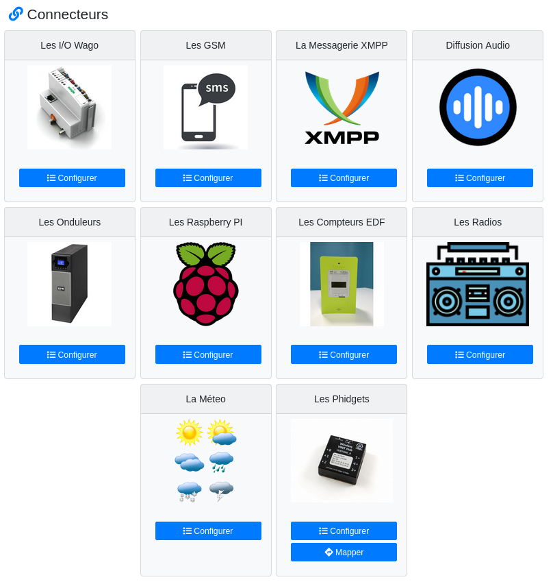

# Les connecteurs

Un connecteur est un composant logiciel embarqués sur chaque [agent](architecture.md#les-agents) permettant de se doter de la capacité
d'intéragir avec certaines technologies.

Les technologies proposées sont présentées dans les pages qui suivent.

Ils sont accessibles via le menu **Connecteurs** de l'interface d'administration.

