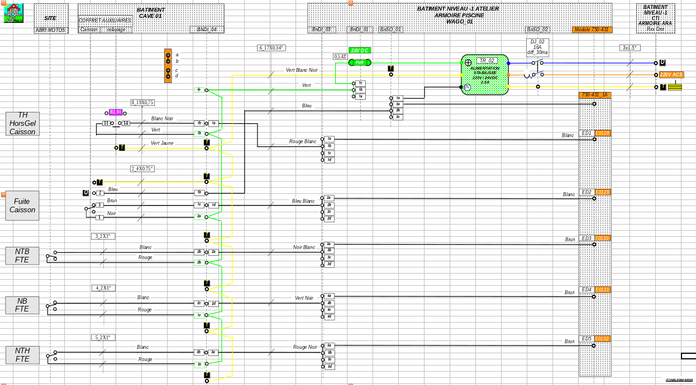

# Les I/O Wago sur Modbus

Ces entrées/sorties s'appuient sur du matériel de la marque allemande WAGO. Essentiellement sur des interfaces de la gamme 750-000.

---
## Matériel

Ce connecteur permet de piloter et controler des I/O depuis:

* Des interfaces type bus de terrain
    * [750-342 - Coupleur ethernet 1ere génération](https://www.wago.com/fr/syst%C3%A8mes-i-o/coupleur-de-bus-de-terrain-ethernet/p/750-342)
    * [750-352 - Coupleur ethernet 3ième génération](https://www.wago.com/fr/syst%C3%A8mes-i-o/coupleur-de-bus-de-terrain-ethernet/p/750-352)
    * [750-362 - Coupleur ethernet 4ième génération](https://www.wago.com/fr/syst%C3%A8mes-i-o/coupleur-de-bus-de-terrain-ethernet/p/750-362)
* Des bornes d'intéractions
    * [750-431 - Entrées Digitales 8 canaux DC 24v](https://www.wago.com/fr/syst%C3%A8mes-i-o/entr%C3%A9e-digitale-%C3%A0-8-canaux/p/750-431)
    * [750-455 - Entrées Analogiques 4 canaux 4/20mA](https://www.wago.com/fr/syst%C3%A8mes-i-o/entr%C3%A9e-analogique-%C3%A0-4-canaux/p/750-455)
    * [750-460 - Entrées PT100 2 fils](https://www.wago.com/fr/syst%C3%A8mes-i-o/entr%C3%A9e-analogique-%C3%A0-4-canaux/p/750-460)
    * [750-461 - Entrées PT100 3 fils](https://www.wago.com/fr/syst%C3%A8mes-i-o/entr%C3%A9e-analogique-%C3%A0-2-canaux/p/750-461)
    * [750-513 - Sorties TOR 2 canaux 220V 2.0A](https://www.wago.com/fr/syst%C3%A8mes-i-o/sortie-de-relais-%C3%A0-2-canaux/p/750-513)
    * [750-530 - Sorties TOR 8 canaux 24V 0.5A](https://www.wago.com/fr/syst%C3%A8mes-i-o/sortie-digitale-%C3%A0-4-canaux/p/750-530)
    * [750-531 - Sorties TOR 4 canaux 24V 0.5A](https://www.wago.com/fr/syst%C3%A8mes-i-o/sortie-digitale-%C3%A0-4-canaux/p/750-531)

---
## Schéma d'exemple

---
## Retour d'experience

En tout, 5 modules wago sont sous tension et tournent depuis 2008 sans aucun souci.
