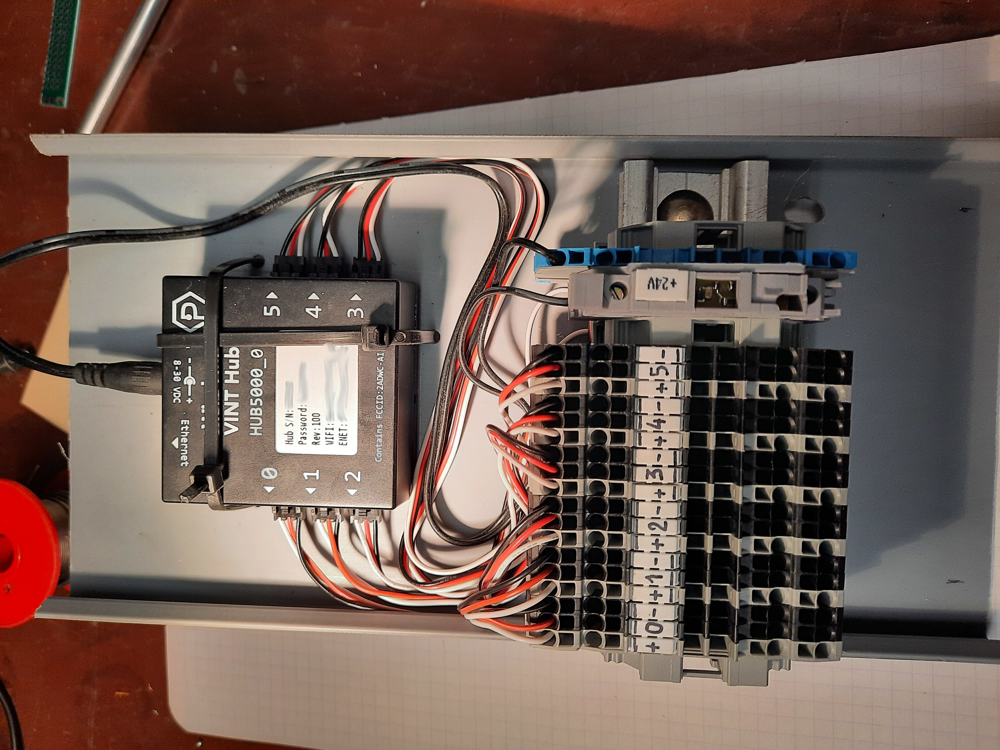

# Les Phidgets

Ces entrées/sorties s'appuient sur du matériel de la marque Phidgets et permettent de mesurer des entrées analogiques, tout ou rien,
ou de piloter des sorties analogiques ou tout ou rien.

---
## Matériel

Ce connecteur permet de piloter et controler un [Hub5000](https://phidgets.com/?prodid=1143) ainsi que ses composants.
Par exemple:

* Une interface de mesure de la tension
    * [VoltageInput](https://phidgets.com/?prodid=955)
* Une interface de pilotage bistable
    * [SHELLY PRO EM 50 Monophasé](https://phidgets.com/?prodid=714)

---
## Cablage et installation

Il suffit de brancher le hub sur un cable RJ45 ou le reseau wifi, puis d'y ajouter les capteurs ou actionneurs.

Une fois la connectique assemblée, il suffit de configurer le HUB dans la console d'administration en lui donnant un `tech_id`
une IP, un mot de passe de connexion.

---
## Mapping D.L.S

Les bits internes suivants sont positionnés au `tech_id` du module D.L.S et sont appelés DIxxx, DOxxx, AIxxx, AOxxx.

Il est necessaire de mapper ces bits internes physiques aux bits internes logiques du D.L.S.
