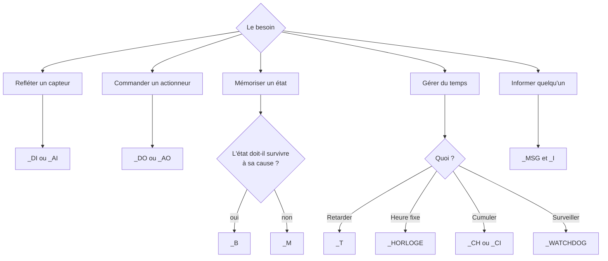

# Les objets D.L.S

Un module D.L.S manipule des **objets** typés. Chaque type a sa sémantique, ses options et son
comportement dans le temps.

Cette section décrit chaque type. Pour la syntaxe générale de déclaration et de mise en œuvre,
voir [anatomie d'un module](../anatomie.md) et [grammaire complète](../grammaire.md).

---

## Les objets liés au monde physique

Ils n'existent que parce qu'une I/O leur est [mappée](../../parcours/03-mapping.md).

| Type | Alias | Nom | Page |
|---|---|---|---|
| `_DI` | `_E` | Entrée tout ou rien | [Entrées T.O.R](di.md) |
| `_DO` | `_A` | Sortie tout ou rien | [Sorties T.O.R](do.md) |
| `_AI` | `_EA` | Entrée analogique | [Entrées analogiques](ai.md) |
| `_AO` | — | Sortie analogique | [Sorties analogiques](ao.md) |

---

## Les objets de mémoire

Ils portent l'état interne de votre automatisme.

| Type | Nom | Comportement | Page |
|---|---|---|---|
| `_B` | Bistable | Maintenu jusqu'à remise à zéro explicite | [Bistables](bistables.md) |
| `_M` | Monostable | Retombe dès que sa condition est fausse | [Monostables](monostables.md) |
| `_R` | Registre | Valeur numérique, consignes et calculs | [Registres](registres.md) |

!!! tip "Bistable ou monostable ?"
    C'est le choix le plus structurant d'un module. **Monostable** pour un état qui n'est que le
    reflet direct d'une condition ; **bistable** pour une mémoire qui doit survivre à la
    disparition de sa cause (un mode de fonctionnement, un défaut à acquitter).

---

## Les objets liés au temps

| Type | Nom | Usage | Page |
|---|---|---|---|
| `_T` | Temporisation | Retarder, maintenir, limiter | [Temporisations](tempos.md) |
| `_HORLOGE` | Horloge | Déclencher à une heure précise | [Horloges](horloges.md) |
| `_CH` | Compteur horaire | Cumuler un temps de marche | [Compteurs horaires](compteurs-horaires.md) |
| `_CI` | Compteur d'impulsions | Compter des manœuvres ou des fronts | [Compteurs d'impulsions](compteurs-impulsions.md) |
| `_WATCHDOG` | Watchdog | Détecter l'absence d'un événement attendu | [Watchdog](watchdog.md) |

---

## Les objets d'interface

| Type | Nom | Destinataire | Page |
|---|---|---|---|
| `_MSG` | Message | L'utilisateur final | [Messages](messages.md) |
| `_I` | Visuel | Les synoptiques | [Visuels](visuels.md) |

---

## Les objets avancés

| Type | Nom | Usage | Page |
|---|---|---|---|
| `_PID` | Régulateur | Asservissement continu | [Régulateurs](pid.md) |
| `_BUS` | Bus | Échange entre modules | [Bus](bus.md) |

---

## Objets particuliers, non déclarés

Certains objets sont fournis par le moteur et s'utilisent sans `#define` :

| Objet | Signification |
|---|---|
| `_START` | Vrai pendant le premier tour d'exécution du module |
| `_TRUE` | Toujours vrai |
| `_FALSE` | Toujours faux |
| `_NOP` | Ne fait rien ; utile comme action neutre |
| `_HEURE` | Heure courante, pour les comparaisons |

Les [bits système](../bits-systeme.md) du module `SYS` complètent cette liste avec l'état interne
du moteur.

---

## Choisir le bon objet

