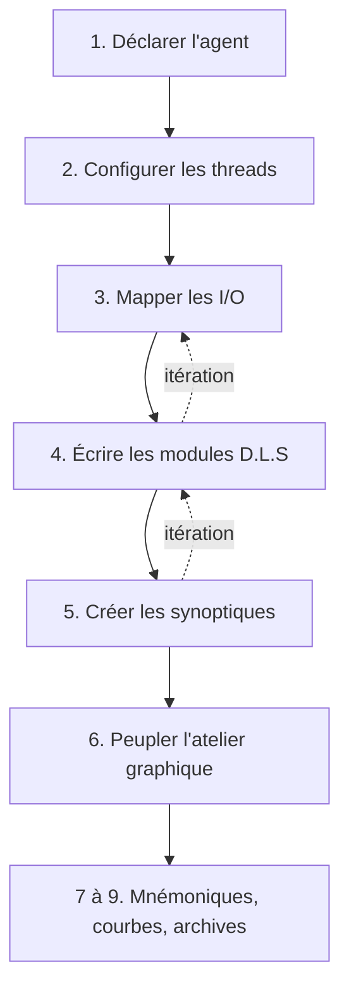

# Volet Technicien

Ce volet s'adresse à la personne qui **construit et fait évoluer l'intelligence du domaine** :
mapping des entrées/sorties, modules D.L.S, synoptiques.

Vous travaillez depuis la [Console](https://console.abls-habitat.fr), sans jamais vous connecter
en SSH sur les machines.

!!! note "Ce volet ne traite pas…"
    …de l'installation des agents ni de leur configuration système : cela relève du
    [volet Administrateur](../admin/index.md). Vous partez d'un parc d'agents déjà installés,
    enrôlés et joignables.

---

## Prérequis

- Un compte avec un **niveau d'habilitation ≥ 6** sur le domaine
  (voir [les habilitations](../admin/habilitations.md)).
- Les agents nécessaires déjà installés et visibles dans la Console.
- La connaissance du câblage : quel capteur sur quelle entrée, quel actionneur sur quelle sortie.

!!! tip "Réclamez le plan de câblage"
    Sans correspondance écrite entre les bornes physiques et ce qu'elles commandent, le mapping
    se fait à tâtons. C'est le document à exiger de l'installateur électricien avant de commencer.

---

## Le parcours de mise en service

| Étape | Page | Ce que vous y faites |
|---|---|---|
| 1 | [Ajouter un agent](parcours/01-agent.md) | Rattacher un agent au domaine |
| 2 | [Configurer les threads](parcours/02-threads.md) | Créer les instances de connecteurs |
| 3 | [Mapper les I/O](parcours/03-mapping.md) | Relier le physique aux mnémoniques |
| 4 | [Écrire les modules D.L.S](parcours/04-dls.md) | Coder, compiler, tester la logique |
| 5 | [Créer les synoptiques](parcours/05-synoptiques.md) | Structurer les pages de visualisation |
| 6 | [Peupler l'atelier graphique](parcours/06-atelier.md) | Placer les visuels sur les plans |
| 7 | [Gérer les mnémoniques](parcours/07-mnemos.md) | Consulter et nommer les variables |
| 8 | [Ajouter des tableaux de courbes](parcours/08-tableaux.md) | Tracer des historiques |
| 9 | [Paramétrer les archives](parcours/09-archives.md) | Choisir ce qui est conservé, et combien de temps |

!!! tip "L'ordre compte, mais le parcours est itératif"
    Suivez l'ordre pour la première mise en service. Ensuite, chaque évolution rejoue une boucle
    courte : ajouter une I/O, l'exposer en D.L.S, l'afficher sur un synoptique.

---

## Les références

Une fois le parcours connu, ces sections sont vos outils du quotidien.

-   **[Le langage D.L.S](dls/index.md)**

    ---

    Concepts, anatomie d'un module, grammaire, logique booléenne, calculs.

-   **[Les objets D.L.S](dls/objets/index.md)**

    ---

    Un chapitre par type : entrées, sorties, bistables, temporisations, messages, visuels…

-   **[Les connecteurs et leurs I/O](connecteurs/index.md)**

    ---

    Ce que chaque technologie expose, et comment la mapper.

-   **[La bibliothèque de visuels](visuels/index.md)**

    ---

    Toutes les formes disponibles pour habiller un synoptique.

-   **[Les exemples commentés](dls/exemples/index.md)**

    ---

    Des modules réels décortiqués ligne à ligne.

-   **[La référence de la Console](console/index.md)**

    ---

    Écran par écran, ce que fait chaque page.

---

## Les cinq notions à maîtriser

### Agent

Processus logiciel installé sur une machine, qui dialogue avec le matériel.
Identifié par sa **classe** (`modbus`, `gpiod`…) et son **`tech_id`**.
Vous ne l'installez pas, vous le **déclarez** et le configurez.

### Thread (connecteur)

Instance de connexion à une technologie au sein d'un agent : une liaison Modbus, un contrôleur
GPIO, une zone audio. Chaque thread porte ses propres I/O.

### Mnémonique

Nom logique d'une variable du domaine, de la forme `MODULE:OBJET`
(`TEMP:JARDIN`, `POMPE_PAC:DO_ACT_TELE`).
Les mnémoniques naissent de la compilation D.L.S et du mapping.

!!! note "Le tech_id implicite"
    Dans un module D.L.S, un objet cité sans préfixe appartient au module courant.
    `VISU_POMPE` dans le module `POMPE_PAC` désigne `POMPE_PAC:VISU_POMPE`.

### Module D.L.S

Unité de programme compilée indépendamment. Un module a un nom, un code source, des paramètres et
un état d'exécution consultable en temps réel.

### Synoptique

Page de visualisation destinée à l'utilisateur final : un fond de plan, des visuels animés par
les objets `_I`, des commandes cliquables.

---

## Aide-mémoire : les pages de la Console

| Action | Chemin |
|---|---|
| Tableau de bord | [/dashboard](https://console.abls-habitat.fr/dashboard) |
| Lister les agents | [/agents](https://console.abls-habitat.fr/agents) |
| Ajouter un agent | [/agent/add](https://console.abls-habitat.fr/agent/add) |
| Lister les modules D.L.S | [/dls](https://console.abls-habitat.fr/dls) |
| État temps réel des modules | [/dls_status](https://console.abls-habitat.fr/dls_status) |
| Dictionnaire des mnémoniques | [/search](https://console.abls-habitat.fr/search) |
| Mnémoniques | [/mnemos](https://console.abls-habitat.fr/mnemos) |
| Synoptiques | [/synoptiques](https://console.abls-habitat.fr/synoptiques) |
| Tableaux de courbes | [/tableau](https://console.abls-habitat.fr/tableau) |
| Caméras | [/cameras](https://console.abls-habitat.fr/cameras) |
| Zones audio | [/audio/zones](https://console.abls-habitat.fr/audio/zones) |
| Configuration du domaine | [/domains](https://console.abls-habitat.fr/domains) |

!!! note "Sélection du domaine"
    Toutes les actions portent sur le **domaine actif**. Après connexion, la page
    [/domains](https://console.abls-habitat.fr/domains) vous invite à le choisir.
    Vérifiez-le avant toute modification.
